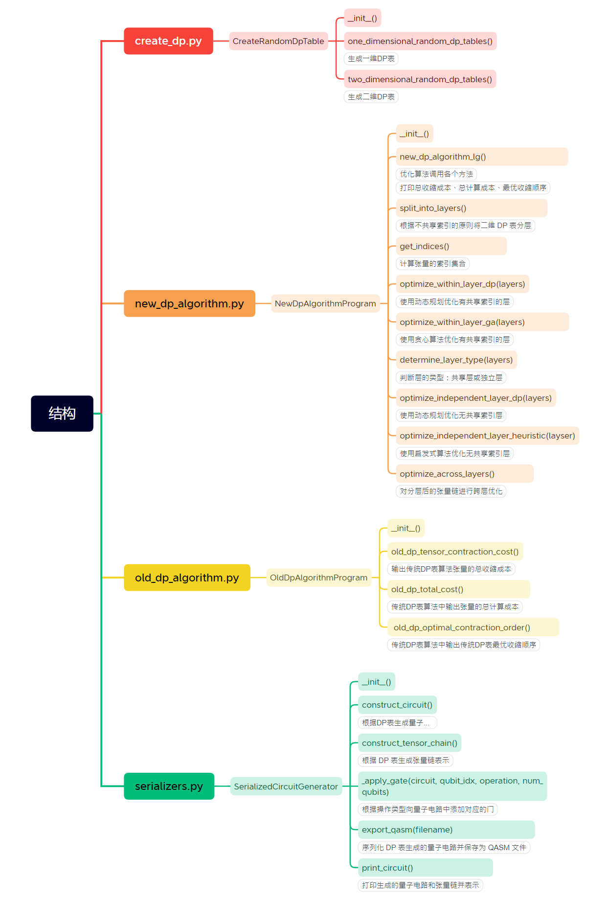

# OptimizedDPTable

### I. Introduction to OptimizedDPTable

&nbsp;&nbsp;`OptimizedDPTable` is designed to implement an optimized DP table algorithm. It also supports the following functionalities:
1. Random generation of one-dimensional or two-dimensional DP tables.
2. Traditional DP table algorithm (dynamic programming).
3. **Optimized DP table algorithms (greedy algorithm, dynamic programming, heuristic algorithm).**
4. Print quantum circuit structure to the console.
5. Serialize the quantum circuit and store it as a QASM file.
6. Calculate the computation cost of tensor contraction.

### II. Parameter Explanation

1. `Total contraction cost` is an overall optimization result. `Global total cost` is the result of layered optimization, which may be more efficient in some scenarios, although its cost is higher than the globally optimal value.

### III. Optimized DP Table Algorithm Approach

&nbsp;&nbsp;The earliest DP table tensor contraction optimization algorithm was the `matrix chain multiplication dynamic programming algorithm`, which is not suitable for cross-layer optimization and complex structures. Currently, research is focused on a layered optimization approach. The main idea of this program is as follows:
1. **Layered Processing**: Group tensors with shared indices into the same layer to reduce the complexity of in-layer optimization. Tensors without shared indices are combined into independent layers and are processed later during cross-layer optimization as independent tensors.
2. **In-Layer Optimization**: Layers with shared indices can be optimized using dynamic programming or a greedy algorithm, while layers without shared indices are optimized using either dynamic programming or heuristic algorithms.
3. **Cross-Layer Optimization**: Combine tensors from different layers, considering the effect of global shared indices on the computational cost. This step constructs a cross-layer DP table and computes the globally optimal contraction sequence.

### IV. Main Function Logic (Not Updated)

1. Call two methods from the `CreateRandomDpTable` class, `one_dimensional_random_dp_tables()` and `two_dimensional_random_dp_tables()`, to generate random DP tables and store them in arrays. One-dimensional DP tables are stored in a two-dimensional array, and two-dimensional DP tables are stored in a three-dimensional array.
2. Call `serialize_to_qasm()` from the `SerializedCircuitGenerator` class to serialize the DP tables and store them as `.qasm` files in the Files directory.
3. Call `SerializedCircuitGenerator.print_circuit()` to represent quantum gates using a tensor chain and print the circuit structure to the console.
4. Call `CoreProgram.print_tensor_chain_structure()` to pass the DP tables array returned by the above method, using the traditional DP table algorithm (`matrix chain multiplication dynamic programming algorithm`), and call `CoreProgram.calculate_tensor_contraction_cost()` and `CoreProgram.calculate_total_cost()` to print the `total contraction cost` and `optimal contraction sequence` to the console.
5. Call the `OptimizeDp` class to pass the DP tables array returned by the above method, use the optimized DP table algorithm, and call `CoreProgram.calculate_tensor_contraction_cost()` and `CoreProgram.calculate_total_cost()` to print the `total contraction cost` and `optimal contraction sequence` to the console.

### V. Project Structure

Please write the main functions and methods in `core.py`.

optimized-dptable/  
|  
|-- main.py  &nbsp;&nbsp; # Entry file  
|-- README.en.md &nbsp;&nbsp;&nbsp; # English version of the project description file  
|-- README.md  &nbsp;&nbsp;&nbsp;&nbsp;&nbsp;&nbsp;&nbsp;&nbsp; # Project description file  
|-- requirements.txt  &nbsp;&nbsp;&nbsp;&nbsp; # Dependencies  
|-- .gitignore   &nbsp;&nbsp;&nbsp;&nbsp; &nbsp;&nbsp;&nbsp;&nbsp;&nbsp;&nbsp;&nbsp; &nbsp;&nbsp;  # Git ignore rules  
|-- optimized_dp_table/  &nbsp;&nbsp; # Main project files  
|&nbsp;&nbsp;&nbsp;&nbsp;|-- create_dp.py  &nbsp;&nbsp;&nbsp;&nbsp;&nbsp;&nbsp;&nbsp;&nbsp;&nbsp;&nbsp;&nbsp;&nbsp;&nbsp; # Create random DP tables  
|&nbsp;&nbsp;&nbsp;&nbsp;|-- new_dp_algorithm.py  &nbsp;&nbsp;&nbsp;&nbsp;&nbsp;&nbsp;&nbsp;&nbsp;&nbsp;&nbsp;&nbsp;&nbsp;&nbsp; # Traditional DP table algorithm  
|&nbsp;&nbsp;&nbsp;&nbsp;|-- old_dp_algorithm.py  &nbsp;&nbsp;&nbsp;&nbsp;&nbsp;&nbsp;&nbsp;&nbsp;&nbsp;&nbsp;&nbsp;&nbsp;&nbsp; # Optimized DP table algorithm  
|&nbsp;&nbsp;&nbsp;&nbsp;|-- serializers.py  &nbsp;&nbsp;&nbsp;&nbsp; # Serialize and save to QASM file  
|&nbsp;&nbsp;&nbsp;&nbsp;|-- setting.py  &nbsp;&nbsp;&nbsp;&nbsp;&nbsp;&nbsp;&nbsp;&nbsp;&nbsp;&nbsp; # Configuration  
|-- qasm_files/  &nbsp;&nbsp;&nbsp;&nbsp;&nbsp;&nbsp;&nbsp;&nbsp;&nbsp;&nbsp;&nbsp;&nbsp; # Exported QASM directory

The hierarchy of the page, classes, and methods is as follows:

### VI. Update Log

1. Initial completion

### Others

More features are pending to be added.  

@Author: goware  
@email: goware@163.com

